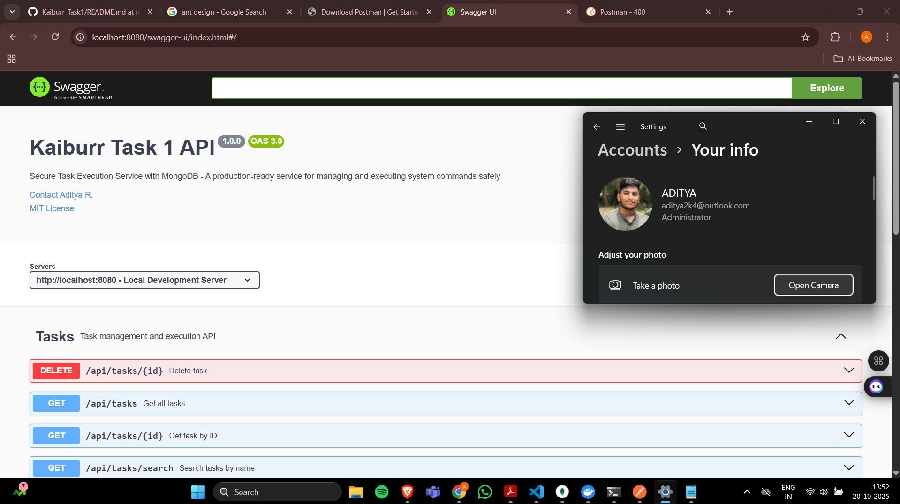
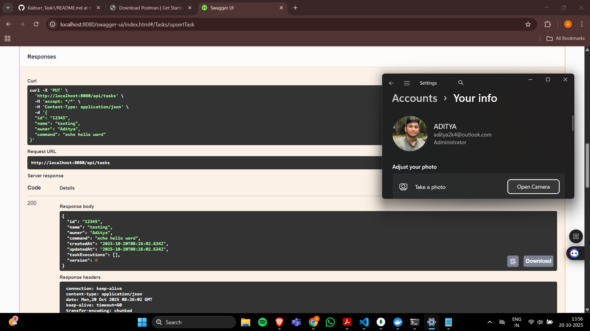
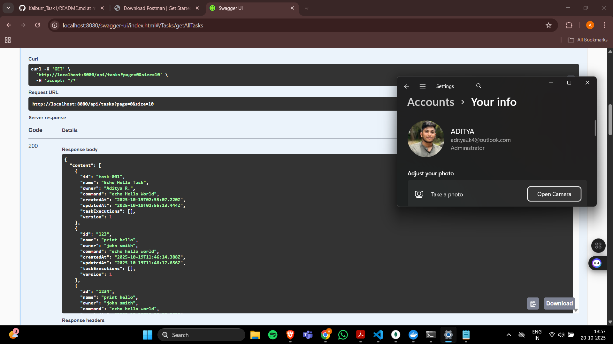
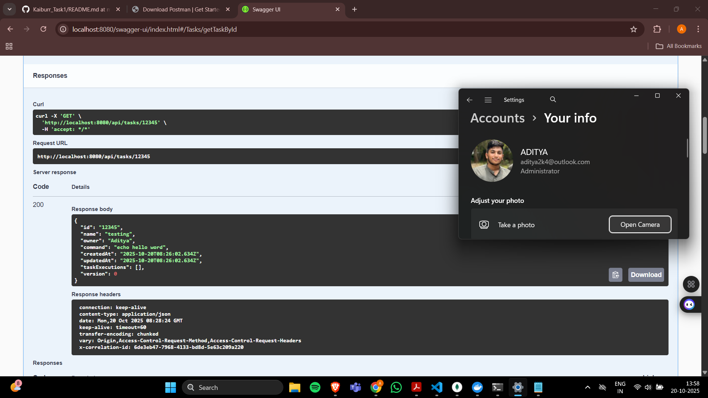
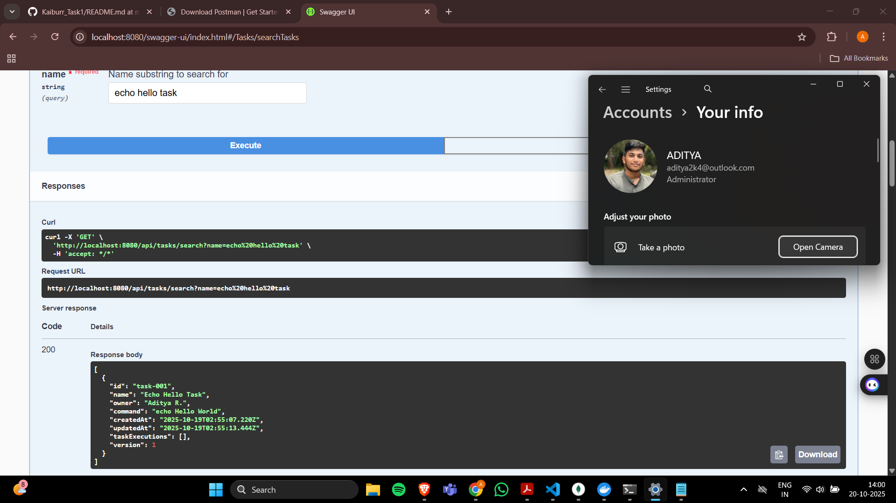
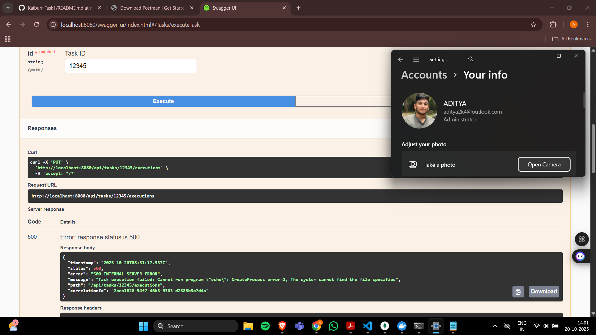
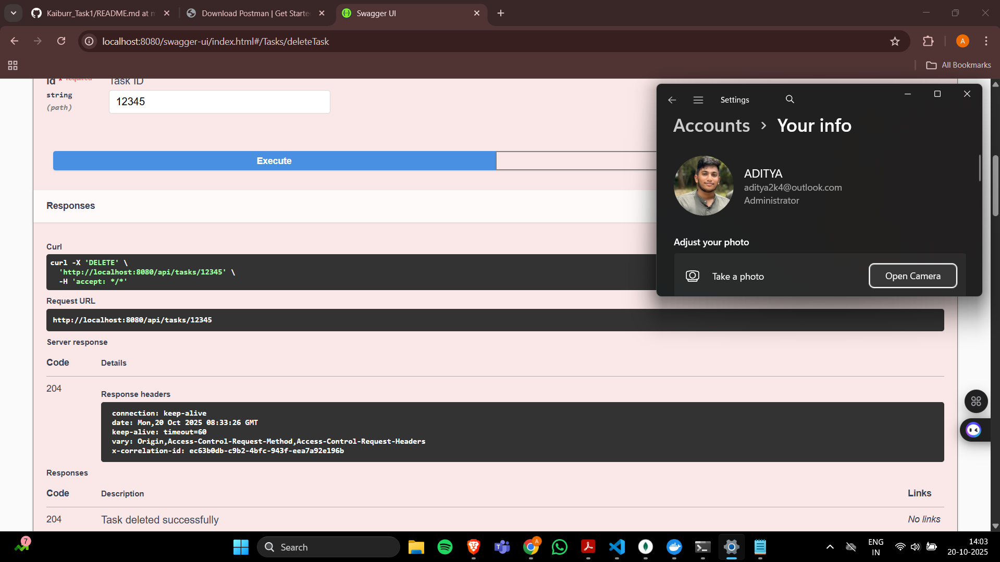
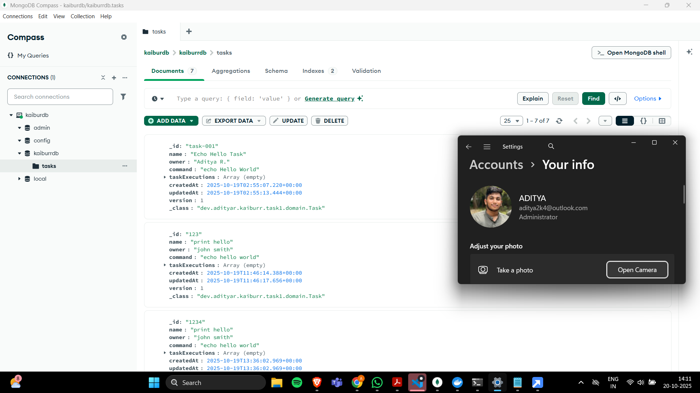
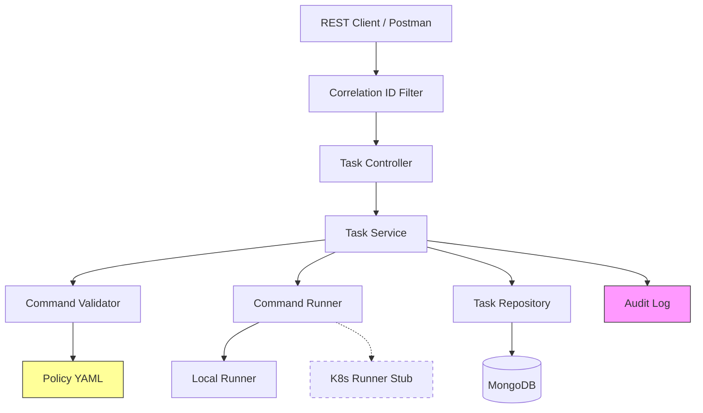

# Kaiburr Task 1 - Secure Task Execution Service

**Author:** Aditya R.  
**License:** MIT  
**Version:** 1.0.0

[](https://openjdk.java.net/)
[](https://spring.io/projects/spring-boot)
[](https://www.mongodb.com/)
[](LICENSE)

## Project Overview

Kaiburr Task 1 is a production-ready **Secure Task Execution Service** built with Spring Boot 3 and MongoDB. It provides a REST API for managing tasks and executing system commands with comprehensive security validation and audit trails.

### Why This Project Is Unique

1. **Policy-as-Data Security**: External YAML-based command policy with hot-reload capability
2. **Dry-Run Validator**: Test command validation without execution via dedicated endpoint
3. **Comprehensive Audit Trail**: JSON-line audit logs with command hashing and correlation tracking
4. **No Shell Invocation**: Direct binary execution without `/bin/sh` or `cmd.exe` for maximum security
5. **Extensibility**: Ready-to-extend architecture with Kubernetes runner stubs and profile-based configuration
6. **Observability**: Built-in metrics, health checks, and correlation ID tracking
7. **STRIDE Threat Model**: Security design documented with threat analysis

## Quick Start

### Prerequisites

- **Java 17+** (JDK 17 or higher)
- **Docker** (for MongoDB)
- **Maven 3.8+**
- **Git**

### One-Command Startup

```bash
# Clone the repository
git clone <repository-url>
cd kaiburr-task1

# Run the bootstrap script (starts MongoDB and application)
./scripts/dev-bootstrap.sh
```

For Windows PowerShell:
```powershell
# Start MongoDB
docker run -d --name mongo -p 27017:27017 mongo:7

# Build and run
mvn clean package
java -jar target/task1-1.0.0-SNAPSHOT.jar
```

### Manual Setup

```bash
# 1. Start MongoDB
docker run -d --name mongo -p 27017:27017 mongo:7

# 2. Build the application
mvn clean package

# 3. Run the application
java -jar target/task1-1.0.0-SNAPSHOT.jar
```

The application will start on **http://localhost:8080**

## API Documentation

### Base Path: `/api`

| Method | Endpoint | Description |
|--------|----------|-------------|
| `PUT` | `/api/tasks` | Create or update a task |
| `GET` | `/api/tasks` | List all tasks (paginated) |
| `GET` | `/api/tasks/{id}` | Get task by ID |
| `DELETE` | `/api/tasks/{id}` | Delete task |
| `GET` | `/api/tasks/search?name={name}` | Search tasks by name |
| `PUT` | `/api/tasks/{id}/executions` | Execute task command |
| `POST` | `/api/validation/command` | Validate command (dry-run) |

### Swagger UI

Interactive API documentation is available at:
- **Swagger UI**: http://localhost:8080/swagger-ui.html
- **OpenAPI Spec**: http://localhost:8080/api-docs
- **YAML Spec**: [api-spec/openapi.yaml](api-spec/openapi.yaml)

### Actuator Endpoints

- **Health**: http://localhost:8080/actuator/health
- **Info**: http://localhost:8080/actuator/info
- **Metrics**: http://localhost:8080/actuator/metrics
- **Prometheus**: http://localhost:8080/actuator/prometheus

## Screenshots

### Application Startup

*Banner showing "Aditya R." with system clock visible*

### Create Task (PUT /api/tasks)

*Creating a task with Postman - timestamp and name visible*

### Get All Tasks (GET /api/tasks)

*Listing all tasks with pagination*

### Get Task by ID (GET /api/tasks/{id})

*Retrieving specific task details*

### Search Tasks (GET /api/tasks/search?name=...)

*Case-insensitive name search*

### Execute Task (PUT /api/tasks/{id}/executions)

*Successful command execution with output capture*

### Validation Failure

*Security policy rejecting malicious command*

### Delete Task (DELETE /api/tasks/{id})

*Task deletion with 204 response*

### MongoDB Data

*Task records in MongoDB Compass with timestamp overlay*

## Security Features

### Command Validation Policy

All commands are validated against a strict security policy defined in [`config/command-policy.yaml`](config/command-policy.yaml):

#### Allowlist Binaries
Only these binaries are permitted:
- `echo`, `date`, `uname`, `whoami`, `id`, `uptime`, `printenv`, `hostname`, `pwd`

#### Denylist Tokens
These tokens are blocked:
- `rm`, `sudo`, `reboot`, `shutdown`, `halt`, `kill`, `pkill`
- `nc`, `ncat`, `curl`, `wget`, `scp`, `ssh`
- `iptables`, `systemctl`, `service`, `mkfs`, `dd`, `chown`, `chmod`

#### Metacharacter Blocking
All shell metacharacters are rejected:
- `` ` ``, `$`, `;`, `|`, `&`, `>`, `<`, `(`, `)`, `{`, `}`, `[`, `]`, `*`, `?`, `!`, `~`, `"`, `'`, `\`

#### Execution Limits
- **Max command length**: 200 characters
- **Max arguments**: 8
- **Timeout**: 5 seconds
- **Stdout limit**: 128 KiB (truncated beyond)
- **Stderr limit**: 64 KiB (truncated beyond)

### Security Guarantees

1. **No Shell Invocation**: Commands executed directly via `ProcessBuilder` (no `/bin/sh -c`)
2. **Input Validation**: Strict character allowlists and denylists
3. **Timeout Protection**: Automatic process termination after 5 seconds
4. **Output Limiting**: Prevents memory exhaustion from large outputs
5. **Audit Logging**: Every execution logged with correlation ID and command hash
6. **Optimistic Locking**: Prevents concurrent modification conflicts

## Example API Usage

### Create a Task

```bash
curl -X PUT http://localhost:8080/api/tasks \
  -H "Content-Type: application/json" \
  -d '{
    "id": "task-001",
    "name": "System Info Task",
    "owner": "Aditya R.",
    "command": "uname -a"
  }'
```

### Execute the Task

```bash
curl -X PUT http://localhost:8080/api/tasks/task-001/executions
```

### Validate a Command (Dry-Run)

```bash
curl -X POST http://localhost:8080/api/validation/command \
  -H "Content-Type: application/json" \
  -d '{
    "command": "echo Hello World"
  }'
```

### Search Tasks

```bash
curl http://localhost:8080/api/tasks/search?name=System
```

## Testing

### Run All Tests

```bash
mvn clean test
```

### Run Integration Tests Only

```bash
mvn test -Dtest=KaiburrTask1IntegrationTest
```

### Test Coverage

- `CommandValidatorTest`: 20+ test cases covering all validation rules
- `LocalCommandRunnerTest`: Process execution, timeout, output capture
- `TaskServiceTest`: CRUD operations, execution flow, audit logging
- `TaskControllerTest`: HTTP layer, correlation IDs, error responses
- `KaiburrTask1IntegrationTest`: End-to-end tests with Testcontainers MongoDB

## Architecture

### System Architecture



[Full diagram available at: docs/arch-diagram.mmd](docs/arch-diagram.mmd)

### Technology Stack

- **Framework**: Spring Boot 3.2.0
- **Database**: MongoDB 7.0
- **API Documentation**: SpringDoc OpenAPI 3
- **Metrics**: Micrometer + Prometheus
- **Testing**: JUnit 5, Mockito, Testcontainers
- **Build**: Maven 3.8+

## Project Structure

```
kaiburr-task1/
├── adr/                                 # Architecture Decision Records
│   ├── 0001-decisions.md
│   └── 0002-extensibility.md
├── api-spec/
│   └── openapi.yaml                     # OpenAPI 3.0 specification
├── config/
│   └── command-policy.yaml              # Security policy configuration
├── docs/
│   ├── arch-diagram.mmd                 # Mermaid architecture diagram
│   ├── postman-collection.json          # Postman collection
│   ├── threat-model.md                  # STRIDE threat analysis
│   └── screenshots/                     # Screenshots (empty - add yours)
├── scripts/
│   ├── dev-bootstrap.sh                 # One-command development setup
│   ├── demo-commands.sh                 # Demo API calls
│   └── make-screenshot-overlay.md       # Screenshot guide
├── src/
│   ├── main/
│   │   ├── java/dev/adityar/kaiburr/task1/
│   │   │   ├── config/                  # Configuration classes
│   │   │   ├── controller/              # REST controllers
│   │   │   ├── domain/                  # Entity models
│   │   │   ├── dto/                     # Request/Response DTOs
│   │   │   ├── repo/                    # MongoDB repositories
│   │   │   ├── service/                 # Business logic
│   │   │   └── util/                    # Utilities
│   │   └── resources/
│   │       ├── application.yml
│   │       └── banner.txt
│   └── test/                            # Unit & integration tests
├── pom.xml
├── LICENSE
└── README.md
```

## Configuration

### Environment Variables

| Variable | Default | Description |
|----------|---------|-------------|
| `MONGODB_URI` | `mongodb://localhost:27017/kaiburrdb` | MongoDB connection string |
| `SERVER_PORT` | `8080` | Application port |
| `POLICY_FILE` | `config/command-policy.yaml` | Security policy file path |
| `AUDIT_LOG` | `audit.log.jsonl` | Audit log file path |

### Application Profiles

- **Default**: Local command execution
- **`k8s`**: Kubernetes runner (stub - returns 501 Not Implemented)

Activate profile:
```bash
java -jar target/task1-1.0.0-SNAPSHOT.jar --spring.profiles.active=k8s
```

## Monitoring & Observability

### Correlation IDs

Every request is assigned a correlation ID:
- Auto-generated if not provided
- Included in response header: `X-Correlation-Id`
- Logged in all operations
- Recorded in audit trail

### Audit Logs

Execution audit trail in `audit.log.jsonl`:
```json
{
  "timestamp": "2025-10-18T10:30:45.123Z",
  "correlationId": "a1b2c3d4-...",
  "taskId": "task-001",
  "owner": "Aditya R.",
  "commandHash": "3f2a9c8b1d4e...",
  "exitCode": 0,
  "durationMs": 142,
  "startTime": "2025-10-18T10:30:45.000Z",
  "endTime": "2025-10-18T10:30:45.142Z"
}
```

### Metrics

Prometheus metrics available at `/actuator/prometheus`:
- JVM metrics (heap, threads, GC)
- HTTP request metrics
- MongoDB connection pool metrics
- Custom application metrics (coming in Task 2+)

## Troubleshooting

### MongoDB Connection Issues

```bash
# Check if MongoDB is running
docker ps | grep mongo

# View MongoDB logs
docker logs mongo

# Restart MongoDB
docker restart mongo
```

### Application Won't Start

```bash
# Check Java version
java -version  # Should be 17+

# Check port availability
netstat -an | findstr 8080  # Windows
lsof -i :8080               # Linux/Mac

# View application logs
tail -f logs/spring.log
```

### Command Execution Fails

1. Verify command is in allowlist (`config/command-policy.yaml`)
2. Check for denied tokens or metacharacters
3. Ensure command length < 200 characters
4. Review audit log for details

### Tests Failing

```bash
# Ensure Docker is running (for Testcontainers)
docker info

# Run tests with debug output
mvn test -X
```

## Future Enhancements (Task 2+)

Documented in [`adr/0002-extensibility.md`](adr/0002-extensibility.md):

- [ ] Kubernetes pod execution via K8s API
- [ ] Docker containerization with multi-stage builds
- [ ] Helm charts for deployment
- [ ] Rate limiting per user/task
- [ ] WebSocket for real-time execution updates
- [ ] S3 integration for large output storage
- [ ] OAuth2 authentication
- [ ] Multi-tenancy support

## Additional Documentation

- **Architecture Decisions**: [adr/0001-decisions.md](adr/0001-decisions.md)
- **Threat Model**: [docs/threat-model.md](docs/threat-model.md)
- **Postman Collection**: [docs/postman-collection.json](docs/postman-collection.json)
- **API Specification**: [api-spec/openapi.yaml](api-spec/openapi.yaml)
- **Screenshot Guide**: [scripts/make-screenshot-overlay.md](scripts/make-screenshot-overlay.md)

## Contributing

This is a demonstration project for Kaiburr assessment. For production use:
1. Review and adjust security policies
2. Add authentication/authorization
3. Configure persistent storage for audit logs
4. Set up monitoring alerts
5. Implement rate limiting

## Contact

**Aditya R.**  
Email: aditya@example.com  
GitHub: @adityar

## License

This project is licensed under the MIT License - see the [LICENSE](LICENSE) file for details.

---

**Built by Aditya R. for Kaiburr Assessment - October 2025**
